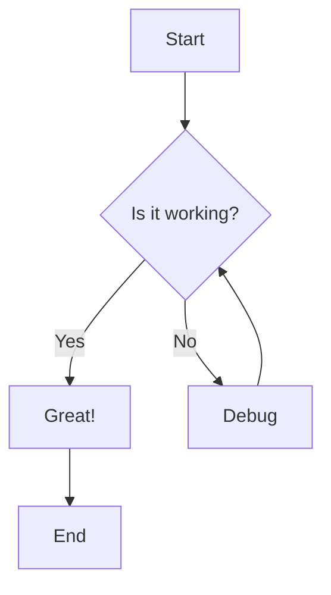
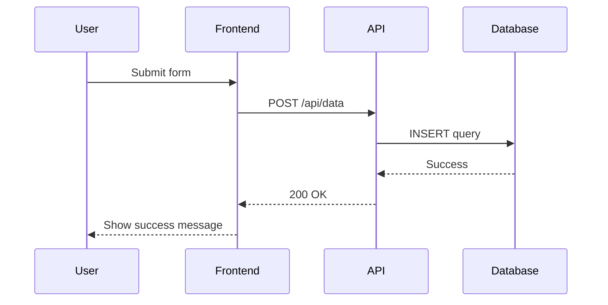
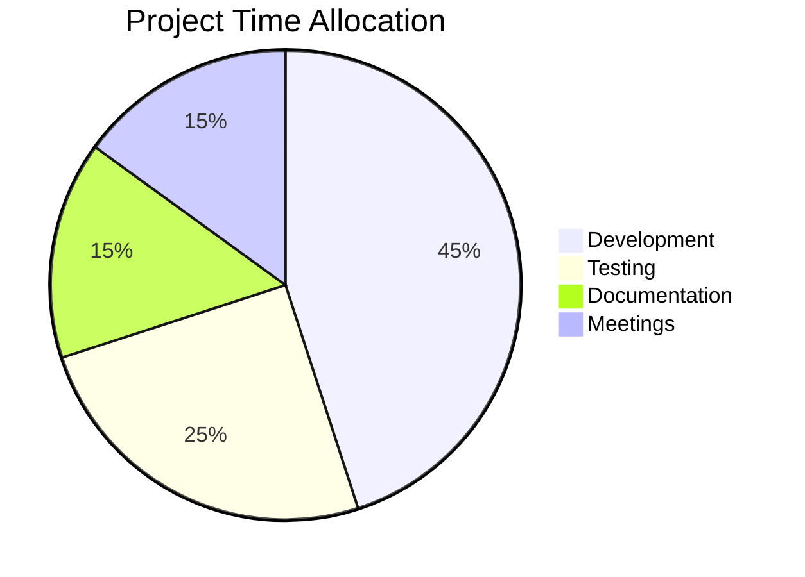

# Svelte Streamdown

[](https://badge.fury.io/js/svelte-streamdown)

A **Svelte port** of [Streamdown](https://streamdown.ai/) by Vercel - an all in one markdown renderer, designed specifically for AI-powered streaming applications.

## 📦 Installation

```bash
npm install svelte-streamdown
# or
pnpm add svelte-streamdown
# or
yarn add svelte-streamdown
```

## 🚀 Overview

Perfect for AI-powered applications that need to stream and render markdown content safely and beautifully, with support for incomplete markdown blocks, security hardening, and rich features like code highlighting, math expressions, and interactive diagrams.

## ✨ Main Features


### 🔄 Streaming-Optimized

- **Incomplete Markdown Parsing**: Handles unterminated blocks gracefully
- **Progressive Rendering**: Perfect for streaming AI responses
- **Real-time Updates**: Optimized for dynamic content

### 🔒 Security Hardening

- **Image Origin Control**: Whitelist allowed image sources
- **Link Safety**: Control link destinations
- **HTML Sanitization**: Prevent XSS attacks

### 🎯 Fully Customizable Components & Theming

- **Every component customizable** with Svelte snippets
- **Granular theming system** - customize every part of every component
- Override default styling and behavior for any markdown element
- Full control over rendering with type-safe props
- Seamless integration with your design system

### 🎨 Built-in Typography Styles

Beautiful, responsive typography with **built-in Tailwind CSS classes** for headings, lists, code blocks, and more. Comes with a complete default theme that works out of the box.

### 📝 GitHub Flavored Markdown

Full support for GitHub Flavored Markdown including:

- Tables
- ~~Strikethrough~~
- Subscript (H~2~O)
- Superscript (E = mc^2^)
- Footnotes [^1]

[^1]:
    Reference render in a popover by default.
    with _rich_ **content** support
    and multiline

### 💻 Interactive Code Blocks

- Syntax highlighting powered by Shiki
- Copy-to-clipboard functionality
- Support any Shiki themes

### 🔢 Mathematical Expressions

LaTeX math support through KaTeX:

- Perfect rendering for scientific content
- Inline math: $E = mc^2$
- Block math:

$$
\\sum_{i=1}^n x_i
$$

### 🧜‍♀️ Mermaid Diagrams

- Render Mermaid diagrams from code blocks
- **Incremental rendering** during streaming content
- Pan and Zoom
- Full screen mode

**Example:**







### Complex table support

#### Colspan

| H1                        | H2  | H3  |
| ------------------------- | --- | --- |
| This cell spans 3 columns |||

| Header 1                  | Header 2 | Header 3 |
| ------------------------- | -------- | -------- |
| This cell spans 2 columns || Normal
| Normal                    | Normal   | Normal   |

#### Rowspan
| Header 1        | Header 2 |
| --------------- | -------- |
| This cell spans | Cell A   |
| two rows ^      | Cell B   |
#### Footer
| Header 1        | Header 2 |
| --------------- | -------- |
| Cell B 		  | Cell A   |
| --------------- | -------- |
| Footer ||

#### Column alignment

| Left | Center | Right |
| :--- | :----: | ----: |
| A    |   B    |     C |

#### Everything 


| Product Category ||| Sales Data Q1-Q4 2024 ||||
| Product | Region || Q1 | Q2 | Q3 | Q4 |
| Name | Type | Area | Revenue | Revenue | Revenue | Revenue |
|-------------|---------|------------|---------|---------|---------|---------|
| Laptop Pro | Electronics | North America || $45,000 | $52,000 | $48,000 |
| Laptop Pro | Electronics | North America || $45,000 | $52,000 | $48,000 |
| Laptop Pro | Electronics | North America || $45,000 | $52,000 | $48,000 |
| Laptop Pro | Electronics | North America || $45,000 | $52,000 | $48,000 |

### Complex list support

#### decimal

1. First item  
2. Second item  
3. Third item

#### lower-alpha

a. First item  
b. Second item  
c. Third item

#### upper-alpha

A. First item  
B. Second item  
C. Third item

#### lower-roman

i. First item  
ii. Second item  
iii. Third item

#### upper-roman

I. First item  
II. Second item  
III. Third item

#### Nested Lists

1. First level (numeric)
   a. Second level (lowercase alpha)
      i. Third level (lowercase roman)
         - Fourth level (bullet)
            I. Fifth level (uppercase roman)
               A. Sixth level (uppercase alpha)

2. Back to the first level

#### Task List

- [ ] Uncompleted task
- [x] Completed task
- [ ] Another uncompleted task
  - [ ] Nested uncompleted subtask
  - [x] Nested completed subtask


### Alert Support

> [!IMPORTANT]
> Native support for Github style Alert


## 🔄 Differences from Original React Version

This Svelte port maintains feature parity with the original [Streamdown](https://streamdown.ai/) while adapting to Svelte's patterns:

| Aspect            | Original (React)         | Svelte Port               |
| ----------------- | ------------------------ | ------------------------- |
| **Framework**     | React                    | Svelte 5                  |
| **Component API** | JSX Components           | Svelte Snippets           |
| **Styling**       | Tailwind CSS             | Tailwind CSS (compatible) |
| **Context**       | React Context            | Svelte Context            |
| **Build System**  | Vite/React               | Vite/SvelteKit            |
| **TypeScript**    | Full TS support          | Full TS support           |
| **Engine**        | Remark / Rehype + marked | marked only               |

### Tailwind CSS Setup

> [!NOTE]
> Streamdown comes with **built-in Tailwind CSS classes** for beautiful default styling. To ensure all styles are included in your build, add the following to your `app.css` or main CSS file:
> This setup is primarily necessary if you're using Tailwind CSS v4's new `@source` directive or if you have aggressive purging enabled in older versions. If you're using standard Tailwind CSS v3+ with default purging, Streamdown's styles should be automatically included when the component is imported and used in your application.
> This ensures that all Streamdown's default styling is included in your Tailwind build process.

```css
@import 'tailwindcss';
/* Add Streamdown styles to your Tailwind build */
@source "../node_modules/svelte-streamdown/**/*";
```

## 🚀 Quick Start

### Basic Usage

```svelte
<script>
	import { Streamdown } from 'svelte-streamdown';

	let content = `# Hello World

This is a **bold** text and this is *italic*.

\`\`\`javascript
console.log('Hello from Streamdown!');
\`\`\`
`;
</script>

<Streamdown {content} />
```

### Advanced Usage with Custom Components

```svelte
<script>
	import { Streamdown } from 'svelte-streamdown';

	let content = `# Custom Components Example

This heading will use a custom component!`;

	// Custom heading component
</script>

{#snippet customHeading({ children, token })}
	<h1 class="mb-4 text-4xl font-bold text-blue-600" {...token.props}>
		{@render children()}
	</h1>
{/snippet}

<Streamdown {content} heading={customHeading} />
```

### Security Configuration

```svelte
<script>
	import { Streamdown } from 'svelte-streamdown';

	let markdown = `
[Safe Link](https://trusted-domain.com/page)`;
</script>

<Streamdown
	{content}
	allowedImagePrefixes={['https://trusted-domain.com']}
	allowedLinkPrefixes={['https://trusted-domain.com']}
/>
```

## 📋 Props API

| Prop                      | Type                                                  | Default          | Description                                    |
| ------------------------- | ----------------------------------------------------- | ---------------- | ---------------------------------------------- |
| `content`                 | `string`                                              | -                | **Required.** The markdown content to render   |
| `class`                   | `string`                                              | -                | CSS class names for the wrapper element        |
| `parseIncompleteMarkdown` | `boolean`                                             | `true`           | Parse and fix incomplete markdown syntax       |
| `defaultOrigin`           | `string`                                              | -                | Default origin for relative URLs               |
| `allowedLinkPrefixes`     | `string[]`                                            | `['*']`          | Allowed URL prefixes for links                 |
| `allowedImagePrefixes`    | `string[]`                                            | `['*']`          | Allowed URL prefixes for images                |
| `skipHtml`                | `boolean`                                             | -                | Skip HTML parsing entirely                     |
| `unwrapDisallowed`        | `boolean`                                             | -                | Unwrap instead of removing disallowed elements |
| `urlTransform`            | `UrlTransform \| null`                                | -                | Custom URL transformation function             |
| `theme`                   | `Partial<Theme>`                                      | -                | Custom theme overrides                         |
| `baseTheme`               | `'tailwind' \| 'shadcn'`                              | `'tailwind'`     | Base theme to use before applying overrides    |
| `mergeTheme`              | `boolean`                                             | `true`           | Whether to merge theme with base theme         |
| `shikiTheme`              | `BundledTheme`                                        | `'github-light'` | Code highlighting theme                        |
| `mermaidConfig`           | `MermaidConfig`                                       | -                | Mermaid diagram configuration                  |
| `katexConfig`             | `KatexOptions \| ((inline: boolean) => KatexOptions)` | -                | KaTeX math rendering options                   |

### Custom Component Props

**Every single markdown element** can be customized with Svelte snippets, giving you
complete control over styling and behavior:

Each snippet receives `{ children, token }` where `token` is a typed token object containing the parsed markdown token with its properties and children is a snippet to be rendered.

```svelte
<script>
	import { Streamdown } from 'svelte-streamdown';

	let content = `# Fully Customizable

This heading uses a custom component with your design system!`;
</script>

{#snippet customHeading({ children, token })}
	<h1
		class="text-gradient mb-6 bg-gradient-to-r from-blue-600 to-purple-600 bg-clip-text text-4xl font-bold text-transparent"
		{...token.props}
	>
		{@render children()}
	</h1>
{/snippet}

{#snippet customCode({ children, token })}
	<code class="rounded bg-gray-100 px-2 py-1 font-mono text-sm dark:bg-gray-800" {...token.props}>
		{@render children()}
	</code>
{/snippet}

{#snippet customBlockquote({ children, token })}
	<blockquote
		class="border-l-4 border-blue-500 pl-4 text-gray-600 italic dark:text-gray-300"
		{...token.props}
	>
		{@render children()}
	</blockquote>
{/snippet}

<Streamdown {content} heading={customHeading} code={customCode} blockquote={customBlockquote} />
```

#### All Available Customizable Elements:

**Text Elements**: `heading`, `p`, `strong`, `em`, `del`

**Links & Media**: `a`, `img`

**Lists**: `ul`, `ol`, `li`

**Code**: `code`, `inlineCode`, `pre`

**Tables**: `table`, `thead`, `tbody`, `tr`, `th`, `td`

**Special Content**: `blockquote`, `hr`, `alert`, `mermaid`, `math`, `inlineMath`

**Note**: The above elements are **supported by Streamdown** and should be customized using individual props or the theme system.

## 🎨 Advanced Theming System

### Built-in Themes

Streamdown comes with two built-in themes:

- **Default Theme**: The standard theme with gray-based colors
- **Shadcn Theme**: A theme that uses shadcn/ui design tokens for seamless integration with shadcn-based projects

Beyond custom snippets, Streamdown provides a **granular theming system** that lets you customize every part of every component without writing custom snippets. You can use the built-in themes (default and shadcn) or create completely custom themes using the `mergeTheme` utility.

### Theme Structure

Every component has multiple themeable parts. For example, the `code` component has:

```typescript
code: {
  base: 'bg-gray-100 rounded p-2 font-mono text-sm',           // Main code block
  container: 'my-4 w-full overflow-hidden rounded-xl border',   // Wrapper container
  header: 'flex items-center justify-between bg-gray-100/80',  // Header with language
  button: 'cursor-pointer p-1 text-gray-600 transition-all',   // Copy button
  language: 'ml-1 font-mono lowercase',                        // Language label
  pre: 'overflow-x-auto font-mono p-0 bg-gray-100/40'        // Pre element
}
```

### Using Custom Themes

```svelte
<script>
	import { Streamdown } from 'svelte-streamdown';

	let content = `# Custom Theme Example

\`\`\`javascript
console.log('Beautiful code blocks!');
\`\`\`

> This blockquote is also themed

| Header 1 | Header 2 |
|----------|----------|
| Cell 1   | Cell 2   |
`;

	// Custom theme overrides
	let customTheme = {
		code: {
			container: 'my-6 rounded-2xl border-2 border-purple-200 shadow-lg',
			header: 'bg-purple-50 text-purple-700 font-medium',
			button: 'text-purple-600 hover:text-purple-800 hover:bg-purple-100'
		},
		blockquote: {
			base: 'border-l-8 border-purple-400 bg-purple-50 p-4 italic text-purple-800'
		},
		table: {
			base: 'border-purple-200 shadow-md',
			container: 'my-6 rounded-lg overflow-hidden'
		},
		th: {
			base: 'bg-purple-100 px-6 py-3 text-purple-900 font-bold'
		},
		td: {
			base: 'px-6 py-3 border-purple-100'
		}
	};
</script>

<Streamdown {content} theme={customTheme} />
```

### All Themeable Components

Each component supports multiple themeable parts:

**Headings (`h1`-`h6`)**: `base`

**Text Elements (`p`, `strong`, `em`, `del`)**: `base`

**Lists (`ul`, `ol`, `li`)**: `base`

**Links (`a`)**: `base`, `blocked` (for blocked/unsafe links)

**Code (`code`)**: `base`, `container`, `header`, `button`, `language`, `skeleton`, `pre`

**Inline Code (`inlineCode`)**: `base`

**Images (`img`)**: `container`, `base`, `downloadButton`

**Tables (`table`, `thead`, `tbody`, `tr`, `th`, `td`)**: `base`, `container` (table only)

**Blockquotes (`blockquote`)**: `base`

**Alerts (`alert`)**: `base`, `title`, `icon`, plus type-specific styles (`note`, `tip`, `warning`, `caution`, `important`)

**Mermaid (`mermaid`)**: `base`, `downloadButton`

**Math (`math`, `inlineMath`)**: `base`

**Other (`hr`, `sup`, `sub`)**: `base`

### Theme Merging

Themes are intelligently merged using Tailwind's class merging utility, so you only need to override the specific parts you want to customize while keeping the default styling for everything else.

## 🛠️ Development

### Setup

```bash
# Clone the repository
git clone <repository-url>
cd svelte-streamdown

# Install dependencies
pnpm install

# Start development server
pnpm dev

# Run tests
pnpm test

# Build for production
pnpm build
```

### Building

```bash
# Build the library
pnpm build

# Preview the showcase app
pnpm preview
```

## 🤝 Contributing

Contributions are welcome! This is a port of the original Streamdown project, so please:

1. Check the [original Streamdown repository](https://github.com/vercel/streamdown) for upstream changes
2. Ensure compatibility with the original API
3. Maintain feature parity where possible
4. Add tests for new features if you want

## 📄 License

MIT

## 🙏 Acknowledgments

- **Original Streamdown**: [Vercel](https://vercel.com) for creating the original React component
- **Svelte Community**: For the amazing framework that made this port possible
- **All Contributors**: For helping improve and maintain this project

---

Made with ❤️ and 🤖
